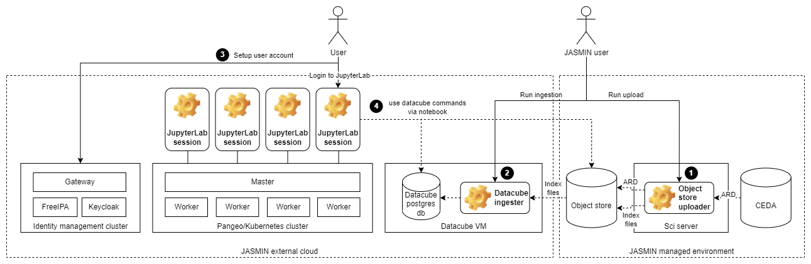

# EODH Datacube
A platform for analysing Sentinel Analysis Ready Data using JupyterHub and the Open Data Cube. Built in JASMIN as an EO DataHub pilot project.

## Overview

The platform can be summarised in the diagram below.

1. ARD from CEDA are uploaded to an object store along with dataset document files containing metadata for each product. (See object_store_uploader.)
2. The dataset documents are downloaded and indexed in a postgres database where they are then queryable by the datacube. (See datacube_ingester.)
3. Users are onboarded onto the identity management system where they set up credentials to access JupyterLab.
4. Users can then login to a JupyterLab environment where they can access the datacube API and the pangeo scientific analysis toolset.

See docs section for more details.

## JASMIN access prerequisites

You will need access to the following:

* JASMIN sci servers (login access)
* An object store tenancy
* An external cloud tenancy
* NoMachine software for graphical linux desktop access (see [Graphical linux desktop using NoMachine NX](https://help.jasmin.ac.uk/article/4810-graphical-linux-desktop-access-using-nx))

## Object store

This is used to store the data files so that they can be accessed from both the managed and unmanaged tenancies, as well as the product level and dataset level index files.

See the [object_store.md](docs/object_store.md) for setup instructions.

If all required data is in CEDA, it's possible to use the data directly from CEDA instead of uploading it to the object store. For this pilot, we upload data to the object store using the `object_store_uploader` python scripts which are run in LOTUS jobs, submitted from JASMIN sci servers.

## Identity management cluster

JASMIN external cloud tenancies require their own user management system which can be spun up using the JASMIN identity manager CaaS. It uses FreeIPA and Keycloak to provide a single sign on for all servers/services in the tenancy.

See the [identity_management_cluster.md](docs/identity_management_cluster.md) for setup instructions.

## Datacube machine

The datacube machine is created in the external cloud tenancy and is used to host the postgres database and the scripts and software to ingest data into it. This pilot makes use of the [cube-in-a-box](https://github.com/opendatacube/cube-in-a-box) which allows for easy setup of a containerised postgres database and datacube CLI.

See the [datacube_machine.md](docs/datacube_machine.md) for setup instructions.

## Pangeo cluster

This CaaS is provided by JASMIN and will set up a kubernetes cluster that spawns pangeo-notebook containers. The containers run a single-user instance of JupyterHub which launches JupyterLab in a pangeo scientific software ecosystem.

See the [pangeo_cluster.md](docs/pangeo_cluster.md) for setup instructions.